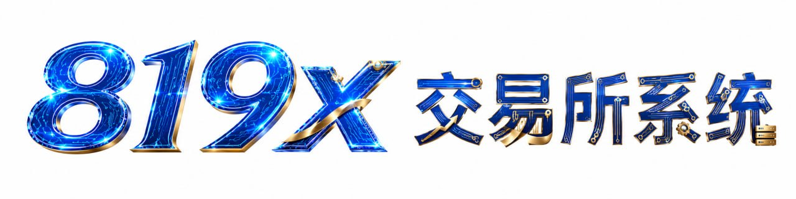

# 819X · 白标交易所框架化产品

**十年沉淀技术底座，满足多种交易逻辑。三天起站，高效稳定。**

[产品矩阵](PRODUCTS.md) · [能力栈](CAPABILITIES.md) · [联系合作](CONTACT.md)

---

## 我们是什么？

**819X** 系捌壹玖數智集團 「原名柯南數智集團」旗下面向品牌方的**白标交易所框架化产品**。

我们不卖单次代码 — 我们提供**经过实战验证的底座 + 快速界面设计重构工程 + 长期可演进的技术路线**。从拿到 品牌名 到上线对外，**最快 1 天**。

---

## 核心亮点

### ⚡ 快速上线

技术底座成熟，新品牌起站只动**外观与文案**，**1-3 天**完成 Logo / 主题色 / 域名 / 客服话术全套替换。

### 🛡️ 实战验证

底座源自十年真实运营的多个生产线项目，已踩过数十个 prod 级坑（资产构建、SSL、WebSocket、宝塔陷阱、CDN 缓存、嵌套陷阱、行情中继等），形成内部经验库。

### 🧩 模板化能力栈

UI 套件、后台主题、撮合接口、拉盘系统、控盘系统、行情对接、客服系统、代理体系 —— 全部模块化，按客户需求**菜单式组合**。

### 🎯 长期可演进

底座持续迭代，老客户 backport 新能力。**一次合作，长期同行**。

---

## 产品线一览

**第一块·纯合约（二元期权秒合约）**
- 主力底座：代理体系完备+单控合约
- 风控变形：冻结/解冻资金/封号 · 适配特殊业务场景
- 配套：客服系统、运营后台

**第二块·合约 + 期货（ST5）**
- 主力底座：代理体系完备+拉盘 + 单控合约
- 风控变形：冻结/解冻资金/封号 · 适配特殊业务场景
- 配套：客服系统、运营后台

详见 [产品矩阵](PRODUCTS.md)。

---

## 合作流程

1. 需求对齐：业务形态、品牌资产、目标用户市场
2. 底座选型：从产品矩阵选最贴近的底座
3. UI+UX定制：深度定制按需排期
4. 上线 + 移交：部署到客户独立服务器，源码与运维 SOP 一并交付（1-3天）
5. 长期支持：选择性订阅底座更新 + 技术支持

---

## 联系我们

详见 [CONTACT.md](CONTACT.md)。

---

**819 · 捌壹玖數智集團**
`「原名柯南數智集團」`
`819.im`

